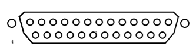

# "Keep Talking and Nobody Explodes" Helper
A simple and easy-to-use command-line tool containing a collection of useful utilities for the game "Keep Talking and Nobody Explodes". [Here](http://store.steampowered.com/app/341800/?snr=1_7_15__13) is the link to the game on Steam. 
**This was developed using [manual version #1](http://www.bombmanual.com/manual/1/pdf/Bomb-Defusal-Manual_1.pdf). This is not guarenteed to work with other versions.** More helpers will be added as development continues. 

## Installation
1. Clone/download repository.
2. Change directory to cloned/downloaded folder.
3. Run **npm install**.
4. Open **scripts** folder. 
5. Open either **unix.sh** (Linux/OSX) or **windows.bat** (Windows) files.

**NOTE:** [Node.js](#https://nodejs.org/en/) must be pre-installed **globally** on your computer.

## Contents
1. [Requirements Before Use](#before)
1. [Helpers](#helpers)
2. [Making Selections](#selections)
3. [Tools Used](#tools)
4. [License](#license)

## [Requirements Before Use](#before)
**Before using the helpers, you will need to know if...**
* The last digit of the bomb's serial number is even or odd
* The bomb posseses or does not posses a parallel port
 

* The number of batteries the bomb posseses

## [Helpers](#helpers)
* [Complicated Wires](#complicated_wires)

## [Complicated Wires](#complicated_wires)
After starting the complicated wires sequence, simply [select](#selections) the wire's properties and press \<Enter>. The decision will then be shown on the next line.
If there are more wires to go, select 'Yes' at the prompt that asks 'Another wire?' and the sequence will restart. Select 'No' at that same prompt to end the sequence.

## [Making Selections](#selections)
Selections can be made by pressing \<Space>. To select all, press \<a> and to de-select a selection, press \<i>.

## [Tools Used](#tools)
[Inquirer](https://www.npmjs.com/package/inquirer) - A collection of common interactive command line user interfaces.
 
[Colors](https://www.npmjs.com/package/colors) - For styling the console.
 
[Underscore](http://underscorejs.org/) - Javascript helpers and utilities.

## [Licence](#license)

Copyright (c) 2016 Michael Scott.
Licensed under the MIT license.
